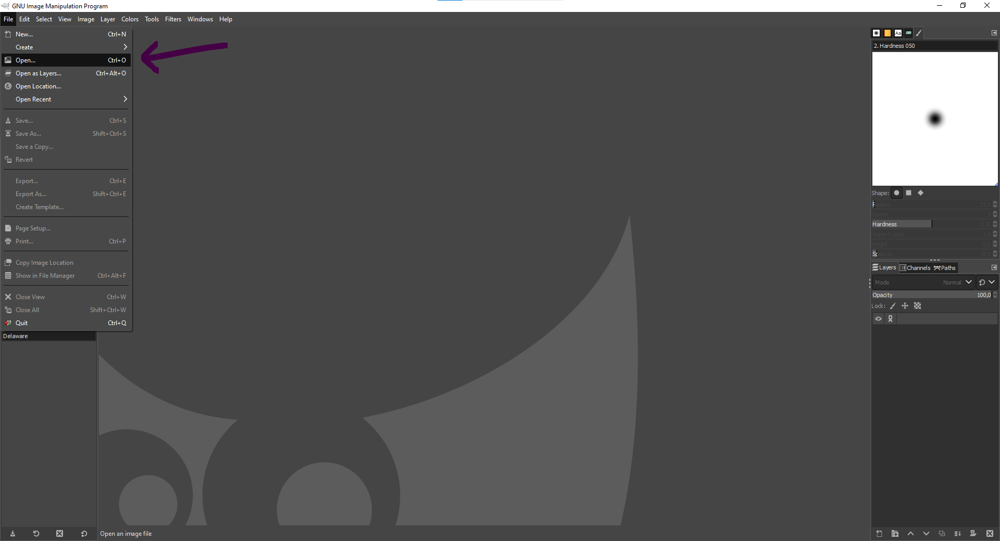
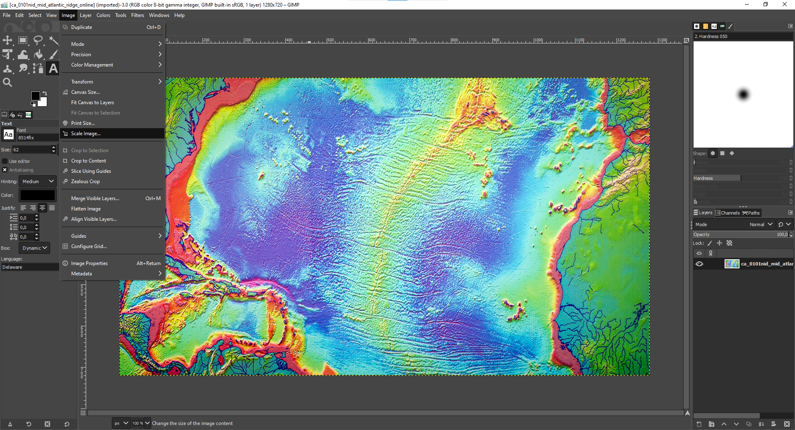
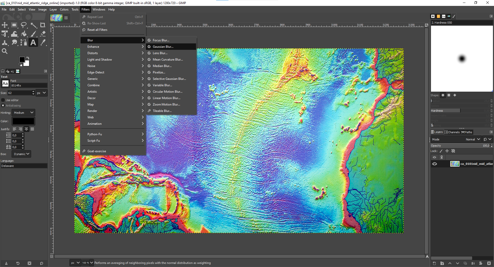
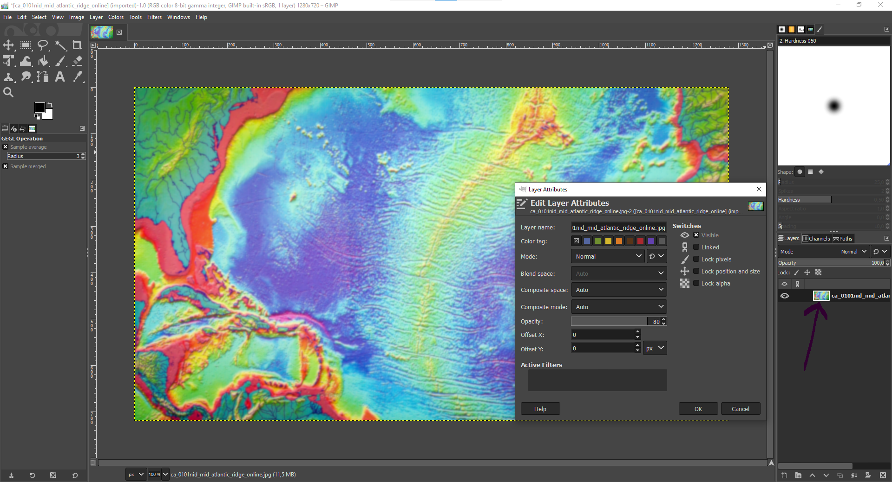
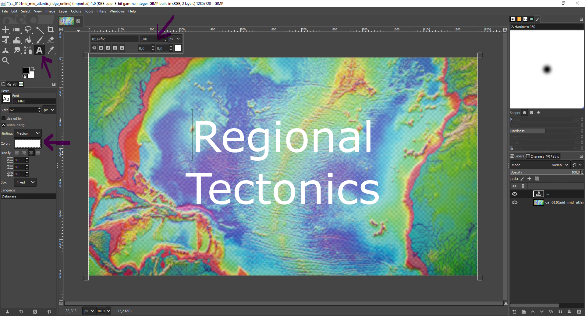
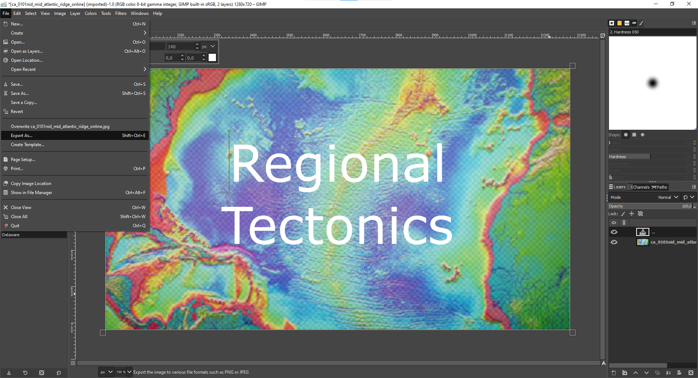

Below I introduce the steps how the title figure of this [blog post](kinematic-motion-anatolia) was generated, with the white bold title overlaying the blurred image. Since the post *Present-day kinematic motion of Anatolia* links global and regional plate tectonics, I searched for a related figure and came across an interesting article in [Science](https://www.science.org/content/article/slowdown-plate-tectonics-may-have-led-earth-s-ice-sheets), which displays a color-coded mid-ocean ridge. 

I was lucky, because this figure has already the required size of **1280x720**, otherwise a rescaling would have been necessary to avoid showing a distorted figure in the blog post. However, changing/extracting the preferred size of a *.png* figure is also easily possible with [GIMP](https://www.gimp.org), a free & open-source image editor (I used the most recent version 2.10.34).

1. Load the *.png* figure into GIMP.

2. Check the size of the figure (should be 1280x720) and potentially rescale. In case resizing is necessary, please consult [Gimp Quickies](https://www.gimp.org/tutorials/GIMP_Quickies) or [Use GIMP to Resize an Image](https://guides.lib.umich.edu/c.php?g=282942&p=1888162)

3. Blur the image using a Gaussian Blur, which performs an averaging of neighboring pixels with the normal distribution as weighting.

4. Click on the figure on the right hand side and adjust the opacity, such that the white title can be read better later on (here changed to 80%).

5. Place a textbox over the entire figure. Select a centered justification, choose the color white and and adjust the font (here 140). 

6. Select *Export As...* and choose again *.png*

Now the figure including a title for the [next blog post](kinematic-motion-anatolia) is prepared.

Do you want to get an overview how to use Markdown for blog posts in general? Make sure to check out this [Sample Post](https://thedevslot.com/WhatATheme/blog/sample-post).