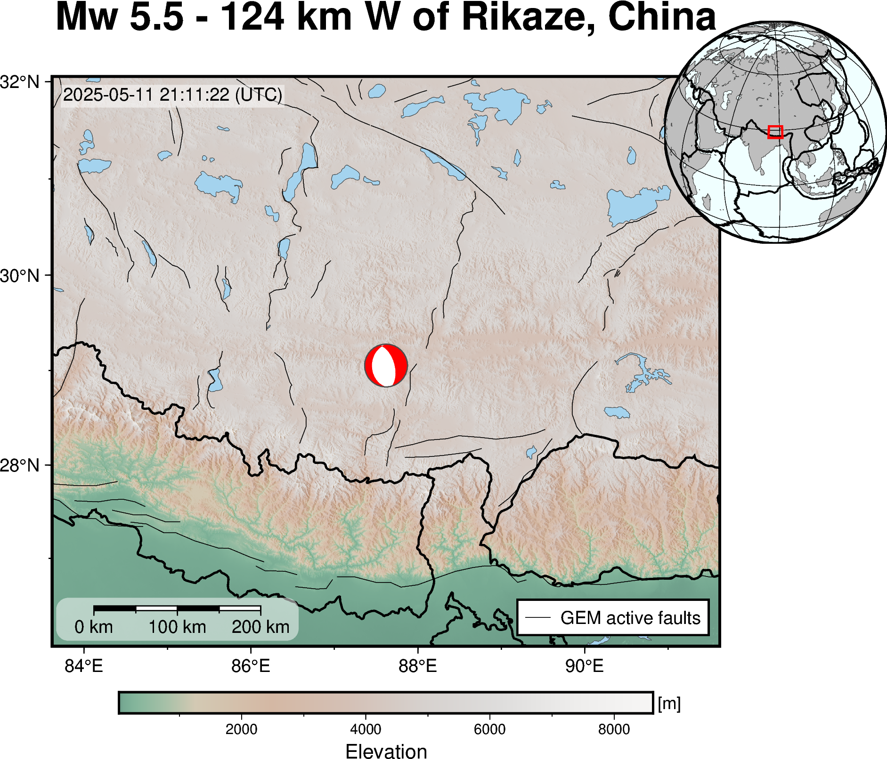
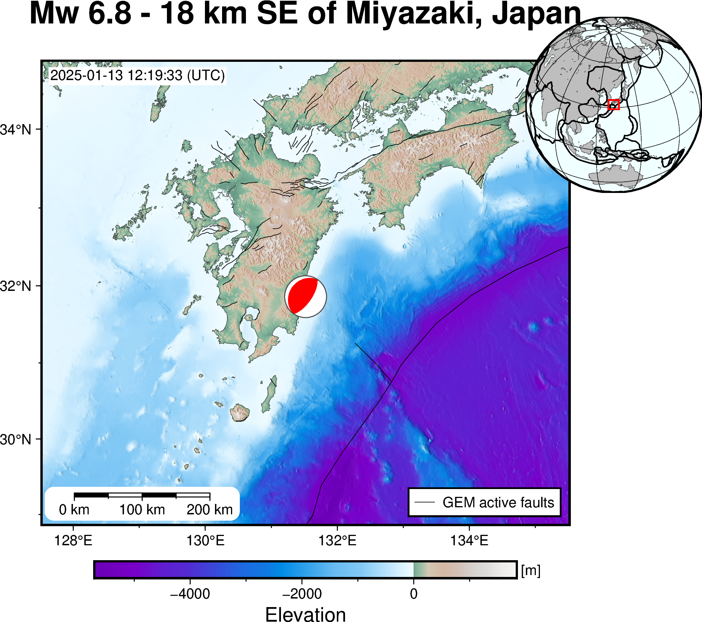
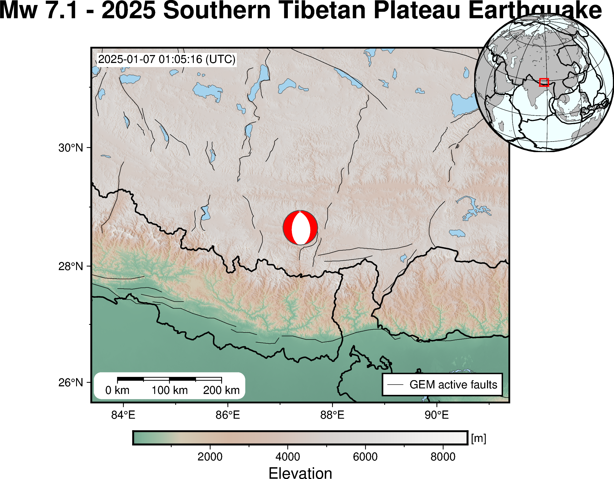
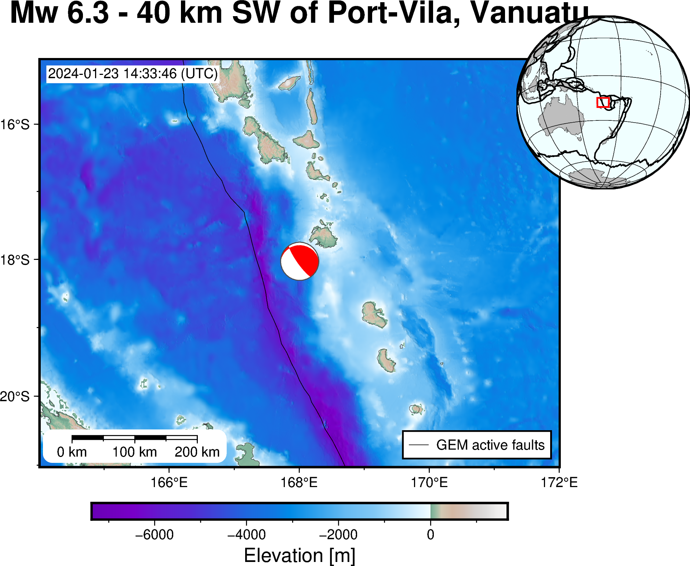

## Significant Earthquakes

This page is automatically updated once the United States Geological Survey (<a href="https://www.usgs.gov" target="_blank">USGS</a>) identifies an earthquake exceeding a significance threshold, which is determined by a combination of magnitude, number of Did You Feel It (DYFI) responses, and PAGER alert level (i.e., Prompt Assessment of Global Earthquakes for Response).

For this automated process the 7-day <a href="https://earthquake.usgs.gov/earthquakes/feed/v1.0/geojson.php" target="_blank">Real-time GeoJSON Feed</a> is used, as it will have the best performance and availability.

Events are displayed top (newest) to bottom (oldest). No liability is taken for the accuracy, completeness or timeliness of the data/figures.

